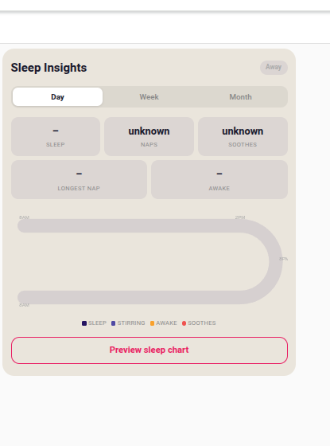
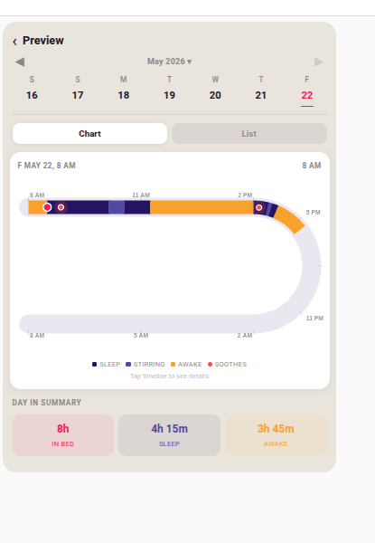
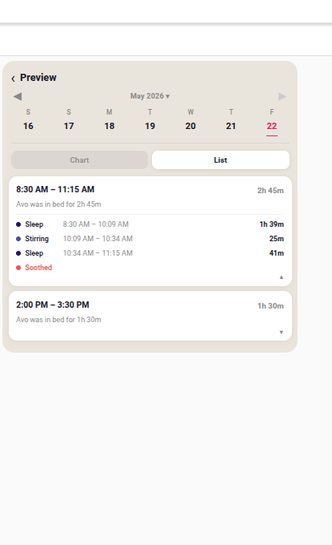
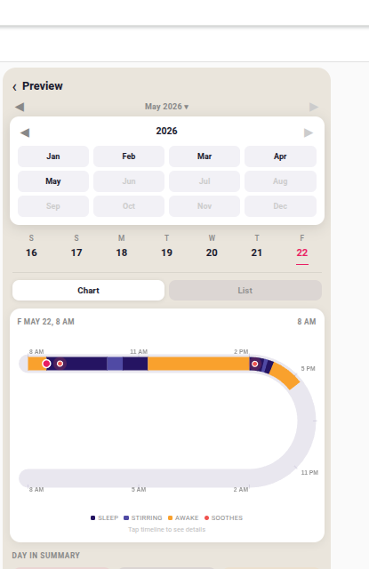

# Cradlewise Smart Crib for Home Assistant

Home Assistant integration for the [Cradlewise Smart Crib](https://www.cradlewise.com/) using the unofficial API.

> **Note:** This uses an unofficial API. Cradlewise may change or restrict access at any time.

## Screenshots

<table>
<tr>
<td align="center"><b>Sleep Insights — Day view</b></td>
<td align="center"><b>Preview chart (C-shape timeline)</b></td>
</tr>
<tr>
<td></td>
<td></td>
</tr>
<tr>
<td align="center"><b>Nap list with sub-phase expand</b></td>
<td align="center"><b>Month/year picker</b></td>
</tr>
<tr>
<td></td>
<td></td>
</tr>
</table>

## Features

### Sensors & Binary Sensors

| Entity | Type | Description |
|--------|------|-------------|
| Sleep phase | Sensor | Current sleep state: away / awake / stirring / sleep |
| Baby present | Binary sensor | Baby detected in crib |
| Bouncing | Binary sensor | Rocking motor active |
| Music playing | Binary sensor | White noise / music active |
| Night light | Binary sensor | Nightlight active |
| Soothe count | Sensor | Soothing interventions today |
| Total sleep | Sensor | Total sleep time today (minutes) |
| Longest nap | Sensor | Longest nap duration today (minutes) |

Real-time updates via cloud MQTT, with REST polling fallback.

### Controls

| Entity | Type | Range / Options | Description |
|--------|------|-----------------|-------------|
| Rocking | Switch | on/off | Start or stop the rocking motor |
| White Noise | Switch | on/off | Play or pause white noise |
| Night Light | Switch | on/off | Toggle the night light |
| Auto Amplitude | Switch | on/off | Let the crib choose rocking intensity automatically |
| Auto Volume | Switch | on/off | Automatically adjust white noise volume |
| Auto Sound Mood | Switch | on/off | Automatically select the best sound profile |
| Keep Music During Sleep | Switch | on/off | Continue music after baby falls asleep |
| Rock Amplitude | Number | 1–5 | Rocking intensity (forced-mode level) |
| Music Volume | Number | 0–60 | White noise volume |
| Light Intensity | Number | 0–100 | Night light brightness (0 = off) |
| Responsivity | Number | 1–10 | Crib soothing sensitivity |
| Sound Profile | Select | White Noise / Deep Sleeper / Noisy Room / Sensitive Sleeper | White noise character |

### Live Camera (local network, optional)

| Entity | Type | Description |
|--------|------|-------------|
| Camera | Camera | Live 1280×720 H.264 stream direct from the crib |

Video is streamed directly over your LAN via WebRTC — no cloud round-trip.
Requires the crib on the same local network as Home Assistant and a one-time cert extraction (see [Camera Setup](#camera-setup-optional) below).

### Sleep Insights Lovelace Card

A custom Lovelace card (`lovelace/cradlewise-sleep-card.js`) that matches the official Cradlewise app's Sleep Insights UI.

**Main view**
- Day / Week / Month tabs
- Live stats: total sleep, nap count, soothes, longest nap, awake time
- Mini C-shape timeline showing current day's sleep phases
- "Preview sleep chart" button to explore historical data

**Preview — Chart tab**
- 7-day scrollable week strip; tap any day to load its data
- C-shape 8 AM → 8 AM (24-hour) timeline canvas
  - Sleep (dark purple), Stirring (light purple), Awake (orange), Soothe dots (red)
  - **Tap anywhere on the track** to see a callout showing exact time + sleep state
- Day in Summary pills: In Bed / Sleep / Awake
- Week navigation ◀ ▶ to move back one week at a time
- **Month/year picker**: tap the "Month Year ▾" label to jump instantly to any past month

**Preview — List tab**
- Nap session cards: time range, total duration, "Avo was in bed for X" summary
- Tap a card to expand sub-phases: Sleep / Stirring / Sleep rows with individual time ranges + durations + "Soothed" indicator

## Installation

[](https://my.home-assistant.io/redirect/hacs_repository/?owner=mezl&repository=ha-cradlewise&category=integration)

Or manually: copy `custom_components/cradlewise` into your HA `config/custom_components/` directory.

## Setup

1. Restart Home Assistant
2. Go to **Settings → Devices & Services → Add Integration**
3. Search for **Cradlewise**
4. Enter your Cradlewise account email and password
5. *(Optional)* Enter the crib's LAN IP address to enable live video

## Sleep Insights Card Setup

1. Copy `lovelace/cradlewise-sleep-card.js` to `config/www/community/cradlewise-sleep-card/` on your HA server
2. Register the resource in HA:
   - Go to **Settings → Dashboards → ⋮ → Manage resources**
   - Add `/local/community/cradlewise-sleep-card/cradlewise-sleep-card.js` as a **JavaScript module**
3. Add a **Manual card** to your dashboard with:

```yaml
type: custom:cradlewise-sleep-card
name: Avo
```

> **Tip:** After updating the JS file, bump the `?v=N` cache-buster in the resource URL and hard-reload (Ctrl+Shift+R).

## Camera Setup (optional)

The camera entity streams H.264 video directly from the crib's local Ant Media Server over WebRTC using mutual TLS certificates bundled in the Cradlewise app.

### 1. Extract the certificates

```bash
# Decompile the Cradlewise APK (install apktool first)
apktool d cradlewise.apk -o cradlewise_unpacked

# Copy the three cert files
cp cradlewise_unpacked/assets/certs/amazon_root_ca1.pem \
   custom_components/cradlewise/certs/
cp cradlewise_unpacked/assets/certs/client.pem \
   custom_components/cradlewise/certs/
cp cradlewise_unpacked/assets/certs/client.key \
   custom_components/cradlewise/certs/
```

### 2. Find the crib's LAN IP

Look for a device named **Cradlewise** (or with a Cradlewise MAC prefix) in your router's DHCP table.

### 3. Configure the integration

- Go to **Settings → Devices & Services → Cradlewise → Reconfigure**
- Enter the crib's LAN IP in the **Crib LAN IP** field
- Restart Home Assistant

> **Note:** The certs are device-account-specific. Keep them private and do not commit them to version control.

## Running Tests

```bash
# Unit tests (no HA or hardware required)
cd ha-cradlewise
pip install pytest pytest-asyncio requests
pytest tests/test_coordinator.py tests/test_sensor_entities.py tests/test_switch_number_entities.py -v

# Hardware-in-the-loop tests (requires live HA + crib)
HA_URL=http://192.168.31.31:8123 HA_TOKEN=<your_token> pytest tests/test_hilt.py -v -s
```

> HILT tests skip automatically if a baby is detected in the crib.

## Supported Firmware

Tested with Cradlewise firmware communicating via AWS IoT MQTT shadow topics. The integration uses the same certificate-based MQTT connection as the official app.
